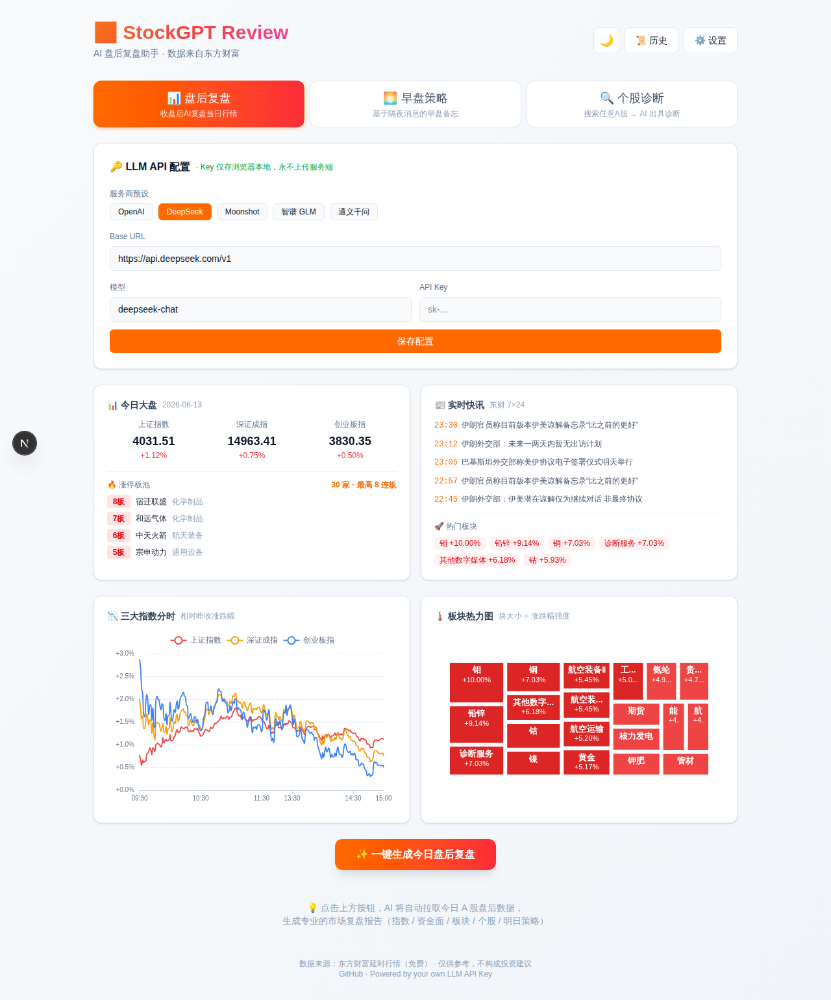
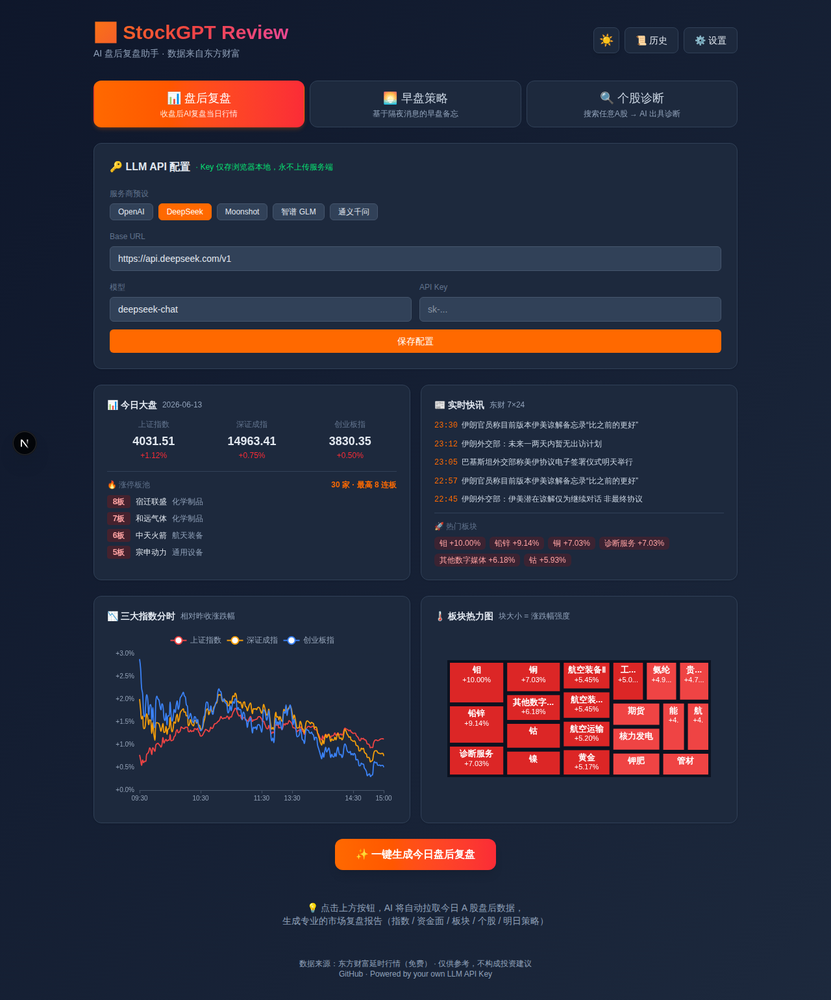

<div align="center">

# 📈 StockGPT Review

**AI-powered A-Share market review tool · 100% client-side · BYOK (Bring Your Own Key)**

**AI 驱动的 A 股盘后复盘助手 · 纯客户端 · 自带 API Key · 零服务器成本**

[](https://nextjs.org/)
[](https://www.typescriptlang.org/)
[](https://tailwindcss.com/)
[](LICENSE)
[](https://vercel.com)

[English](#-english) · [中文](#-中文) · [Live Demo](https://stockgpt-review.vercel.app) · [Report Bug](https://github.com/27dream/stockgpt-review/issues)



</div>

---

## 🇨🇳 中文

### ✨ 这是什么？

**一个让 AI 帮你写 A 股盘后复盘的网页工具**。打开网页 → 填你自己的 LLM API Key → 一键生成专业复盘报告。

- 🧠 **三大场景**：盘后复盘 / 早盘策略 / 个股诊断
- 📊 **数据全免费**：东方财富延时行情接口（指数 / 涨停板 / 板块 / 快讯 / 个股 / 资金流）
- 🔑 **BYOK · 零成本**：用你自己的 API Key（OpenAI / DeepSeek / Moonshot / 智谱 / 通义），Key 仅存浏览器
- 🌗 **明暗主题**：自动跟随系统 + 手动切换
- 📥 **PDF 导出**：报告一键导出 A4 PDF
- 📜 **历史报告**：自动保存最近 10 份在浏览器本地
- 🎨 **可视化**：三大指数分时图 + 板块热力图（ECharts）
- 🚀 **可一键部署到 Vercel**

### 🖼️ 截图

| 浅色主题 | 深色主题 |
|---|---|
|  |  |

### 🚀 快速开始

#### 1. 在线体验
👉 **[stockgpt-review.vercel.app](https://stockgpt-review.vercel.app)**

#### 2. 本地运行

```bash
git clone https://github.com/27dream/stockgpt-review.git
cd stockgpt-review
npm install
npm run dev
# 打开 http://localhost:3000
```

#### 3. 一键部署到 Vercel

[](https://vercel.com/new/clone?repository-url=https://github.com/27dream/stockgpt-review)

### 🔑 LLM 配置

打开网页 → 点 ⚙️ 设置 → 选预设服务商 → 填 API Key → 保存。

支持任何 **OpenAI 兼容协议** 的服务：

| 服务商 | Base URL | 推荐模型 |
|---|---|---|
| OpenAI | `https://api.openai.com/v1` | `gpt-4o-mini` |
| DeepSeek | `https://api.deepseek.com/v1` | `deepseek-chat` |
| Moonshot | `https://api.moonshot.cn/v1` | `moonshot-v1-8k` |
| 智谱 GLM | `https://open.bigmodel.cn/api/paas/v4` | `glm-4-flash` |
| 通义千问 | `https://dashscope.aliyuncs.com/compatible-mode/v1` | `qwen-turbo` |

> 💡 **API Key 仅存于你的浏览器 localStorage**，绝不发送到我们的服务器。

### 🏗️ 技术栈

- **框架**：Next.js 16 (App Router) + React 19 + TypeScript 5
- **样式**：Tailwind CSS 4 + next-themes
- **图表**：ECharts 6
- **PDF**：html2canvas-pro + jsPDF
- **数据源**：东方财富 push2delay / push2his / np-listapi / push2ex / searchapi
- **部署**：Vercel（也支持 Netlify / 自托管）

### 📁 项目结构

```
src/
├── app/
│   ├── api/
│   │   ├── review/route.ts      # LLM 流式生成（review/morning/stock）
│   │   ├── search/route.ts      # 个股搜索
│   │   └── stock/route.ts       # 个股行情
│   ├── layout.tsx
│   └── page.tsx                 # 主页面
├── components/
│   ├── IndexTrendChart.tsx      # 指数分时
│   ├── SectorHeatmap.tsx        # 板块热力图
│   ├── StockSearch.tsx          # 个股搜索
│   ├── HistoryDrawer.tsx        # 历史抽屉
│   └── ThemeToggle.tsx
└── lib/
    ├── eastmoney.ts             # 东财 API 封装
    ├── stock.ts                 # 个股数据
    ├── trends.ts                # 指数分时
    ├── prompt.ts                # 三套 Prompt 模板
    ├── history.ts               # 历史报告 (localStorage)
    └── pdf.ts                   # PDF 导出
```

### 🤝 贡献

欢迎 PR！如果觉得有用，请给个 ⭐️ ~

### ⚠️ 免责声明

数据来自东方财富延时行情，**仅供学习参考，不构成投资建议**。投资有风险，入市需谨慎。

### 📄 License

MIT © [27dream](https://github.com/27dream)

---

## 🇬🇧 English

### ✨ What is this?

**An AI web app that writes daily A-Share market review for you.** Open page → fill in your own LLM API key → generate professional review with one click.

- 🧠 **3 Modes**: After-market review / Pre-market briefing / Single stock diagnosis
- 📊 **Free Data**: East Money delayed-quote APIs (indices / limit-up / sectors / news / stocks / fund flow)
- 🔑 **BYOK · Zero Cost**: Use your own API key (OpenAI / DeepSeek / Moonshot / GLM / Qwen), key stays in browser
- 🌗 **Light/Dark theme**: System-aware + manual toggle
- 📥 **PDF Export**: One-click A4 PDF export
- 📜 **History**: Auto-save last 10 reports in browser
- 🎨 **Charts**: Index intraday + sector heatmap (ECharts)
- 🚀 **One-click Vercel deploy**

### 🚀 Quick Start

#### Try Online
👉 **[stockgpt-review.vercel.app](https://stockgpt-review.vercel.app)**

#### Run Locally

```bash
git clone https://github.com/27dream/stockgpt-review.git
cd stockgpt-review
npm install
npm run dev
# open http://localhost:3000
```

#### Deploy to Vercel

[](https://vercel.com/new/clone?repository-url=https://github.com/27dream/stockgpt-review)

### 🔑 Configure LLM

Click ⚙️ Settings → choose provider preset → fill API key → save.

Any **OpenAI-compatible** endpoint works (OpenAI / DeepSeek / Moonshot / GLM / Qwen).

> 💡 Your API key is stored **only in browser localStorage**, never sent to our server.

### 🏗️ Tech Stack

Next.js 16 · TypeScript · Tailwind v4 · ECharts · html2canvas-pro · jsPDF · East Money APIs · Vercel

### ⚠️ Disclaimer

Data from East Money delayed quotes. **For educational purposes only, NOT investment advice.**

### 📄 License

MIT © [27dream](https://github.com/27dream)

---

<div align="center">

**If you find this useful, please ⭐️ Star the repo!**

**觉得有用？麻烦点个 ⭐️ ～**

</div>
