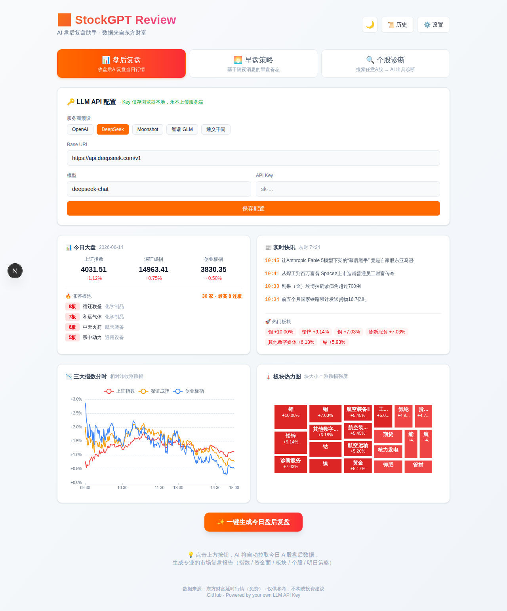

<div align="center">

# 📈 StockGPT Review

**AI 盘后复盘助手 · 一键生成今日 A 股市场报告**

[English](#english) · [中文](#中文)

[](https://opensource.org/licenses/MIT)
[](https://nextjs.org/)
[](https://react.dev/)
[](https://www.typescriptlang.org/)
[](https://github.com/27dream/stockgpt-review)

[🚀 Live Demo](https://stockgpt-review-three.vercel.app) · [🐛 Report Bug](https://github.com/27dream/stockgpt-review/issues) · [💬 Discuss](https://github.com/27dream/stockgpt-review/discussions)



</div>

---

## 中文

**StockGPT Review** 是一个完全开源的 AI 盘后复盘工具。零后端成本（数据全部用东方财富免费 API），零账号体系（LLM API Key 仅存浏览器 localStorage），打开网页即用。

### ✨ 功能亮点

- 📊 **盘后复盘**：一键拉取指数 / 资金流 / 涨停池 / 板块 / 快讯，AI 生成 Markdown 报告
- 🌅 **早盘策略**：基于隔夜消息和昨日数据的开盘备忘
- 🔍 **个股诊断**：搜索任意 A 股代码或名称，AI 给出结构化诊断
- 📈 **可视化**：板块热力图（Treemap）、三大指数分时图、个股 K 线（日/周/月 + MA + 成交量）
- 🖱️ **强交互**：点击板块查看成分股、点个股弹 K 线、点快讯看原文
- 🌓 **暗黑模式**：next-themes 自适应
- 📤 **导出**：PNG / PDF（html2canvas-pro + jspdf）
- 🔐 **隐私优先**：你的 API Key 永不离开浏览器，服务端只做数据中转
- 🔌 **BYOK**：支持 OpenAI / DeepSeek / Moonshot / 智谱 GLM / 通义千问 任意 OpenAI 兼容接口

### 🖼️ 截图

| 浅色模式 | 深色模式 |
|---|---|
|  |  |

### 🚀 快速开始

```bash
git clone https://github.com/27dream/stockgpt-review.git
cd stockgpt-review
pnpm install   # 或 npm install --legacy-peer-deps
pnpm dev
# 访问 http://localhost:3000
```

打开网页 → 选服务商 → 填 API Key（免费的 DeepSeek 就够用）→ 保存 → 点"一键生成"。

### 🏗️ 一键部署到 Vercel

[](https://vercel.com/new/clone?repository-url=https://github.com/27dream/stockgpt-review)

无需配置环境变量，免费版 Hobby 即可承载。

### 🛠 技术栈

- **框架**：Next.js 16 App Router (Turbopack)
- **UI**：React 19 + Tailwind CSS 4 + next-themes
- **图表**：ECharts 6 + echarts-for-react
- **导出**：html2canvas-pro + jspdf
- **数据源**：东方财富延时行情免费 API（`push2delay` / `push2his` / `np-listapi` / `searchapi`）
- **LLM**：任意 OpenAI 兼容接口（流式 SSE）

### 📡 数据来源

全部为东方财富网公开延时行情接口，**不依赖任何付费数据源**：

| 接口 | 用途 |
|---|---|
| `push2delay.eastmoney.com` | 指数 / 个股延时行情、资金流 |
| `push2his.eastmoney.com` | K 线数据（前端浏览器直连） |
| `np-listapi.eastmoney.com` | 7×24 财经快讯 |
| `push2ex.eastmoney.com` | 涨停板池 |
| `searchapi.eastmoney.com` | 个股搜索 |
| `emappdata.eastmoney.com` | 板块成分股 |

### 📁 项目结构

```
src/
├── app/
│   ├── api/            # 数据中转（market / hot / sector / stock / search / review）
│   └── page.tsx        # 主页
├── components/
│   ├── KlineChart.tsx          # K 线（日/周/月 + MA + 成交量）
│   ├── SectorHeatmap.tsx       # 板块热力图
│   ├── IndexTrendChart.tsx     # 三大指数分时
│   ├── SectorDetailModal.tsx   # 板块成分股弹层
│   ├── HistoryDrawer.tsx       # 历史报告抽屉
│   └── Modal.tsx               # 通用弹层
└── lib/
    ├── eastmoney.ts            # 东财 API 封装
    ├── news.ts                 # 快讯 + 涨停池
    └── llm.ts                  # LLM 流式调用
```

### ⚖️ 免责声明

本项目仅用于个人学习研究，所有数据来自东方财富网公开延时行情接口。**报告由 AI 生成，不构成任何投资建议**，盈亏自负。

### 📜 协议

MIT

---

## English

**StockGPT Review** is a fully open-source AI-powered Chinese A-share post-market review tool. **Zero backend cost** (all data from EastMoney free APIs), **zero account system** (LLM API key stored only in browser localStorage), works out of the box.

### ✨ Features

- 📊 **Post-Market Review** — one-click pull of indices / capital flow / limit-up pool / sectors / news, AI generates Markdown report
- 🌅 **Pre-Market Strategy** — opening memo based on overnight news
- 🔍 **Stock Diagnosis** — search any A-share by code or name, get structured AI analysis
- 📈 **Charts** — sector treemap, intraday index lines, stock K-line (D/W/M + MA + volume)
- 🖱️ **Interactive** — click sector to see constituents, click stock for K-line modal, click news for full text
- 🌓 **Dark Mode** — auto via next-themes
- 📤 **Export** — PNG / PDF
- 🔐 **Privacy-first** — your API key never leaves the browser
- 🔌 **BYOK** — any OpenAI-compatible endpoint (OpenAI / DeepSeek / Moonshot / Zhipu / Qwen)

### 🚀 Quick Start

```bash
git clone https://github.com/27dream/stockgpt-review.git
cd stockgpt-review
pnpm install   # or: npm install --legacy-peer-deps
pnpm dev
```

Open `http://localhost:3000`, pick a provider, paste your API key (DeepSeek's free tier is enough), hit save, then click **"One-click generate"**.

### 🏗 Deploy to Vercel

[](https://vercel.com/new/clone?repository-url=https://github.com/27dream/stockgpt-review)

No env vars needed. Free Hobby tier handles it.

### 🛠 Tech Stack

- Next.js 16 (Turbopack) + React 19 + TypeScript 5
- Tailwind CSS 4 + next-themes
- ECharts 6
- html2canvas-pro + jspdf
- EastMoney free delayed market data API
- Any OpenAI-compatible LLM via streaming SSE

### ⚠️ Disclaimer

For educational/research purposes only. **AI-generated reports are not investment advice.** Use at your own risk.

### 📜 License

MIT

---

<div align="center">

If this project helps you, please give it a ⭐️ — it really matters!

Built with ❤️ for the open-source community

</div>
